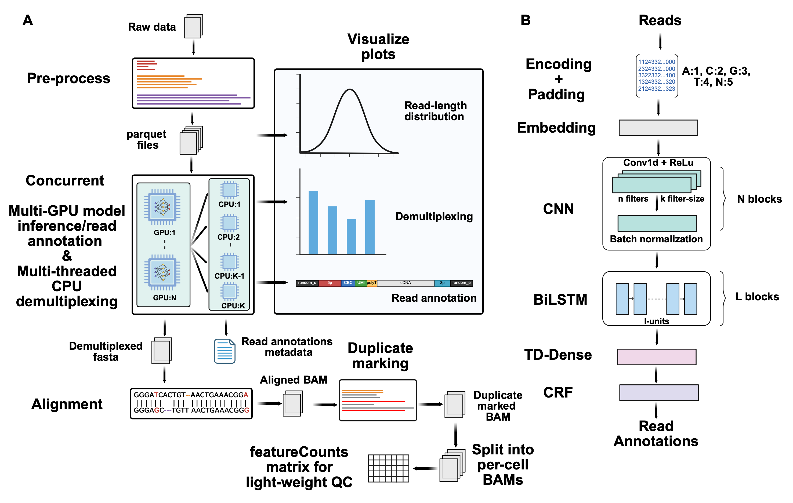

<b>PLEASE BE AWARE THAT THIS WEBSITE IS UNDER ACTIVE DEVELOPMENT AND MAY CHANGE DRASTICALLY FROM DAY TO DAY. IF YOU NEED
A MORE STABLE VERSION PLEASE CHECK BACK IN A MONTH.</b>

Tranquillyzer (<b>TRAN</b>script <b>QU</b>antification <b>I</b>n <b>L</b>ong reads-ana<b>LYZER</b>) is a flexible,
architecture-aware deep learning framework for processing long-read single-cell RNA-seq (scRNA-seq) data. It employs a
hybrid neural network architecture and a global, context-aware design that enables the precise identification of
structural elements. In addition to supporting established single-cell protocols (e.g., the 10x Chromium Single Cell 3'
Gene Expression protocol), Tranquillyzer accommodates custom library formats through rapid, one-time model training on
user-defined label schemas. Model training for both established and custom protocols can be typically completed within
a few hours on standard GPUs.

For a detailed description of the framework, benchmarking results, and application to real datasets, please refer to the
[preprint](https://www.biorxiv.org/content/10.1101/2025.07.25.666829v1).

# Citation

### bioRxiv

```
Tranquillyzer: A Flexible Neural Network Framework for Structural Annotation and
Demultiplexing of Long-Read Transcriptomes. Ayush Semwal, Jacob Morrison, Ian
Beddows, Theron Palmer, Mary F. Majewski, H. Josh Jang, Benjamin K. Johnson, Hui
Shen. bioRxiv 2025.07.25.666829; doi: https://doi.org/10.1101/2025.07.25.666829.
```

# Quick Start

For a guide to getting started with Tranquillyzer, see the [Quick Start guide](webpages/quick_start.qmd).

# Installation

Tranquillyzer is available through a variety of methods. See the [Installation](webpages/install.qmd) page for details.

# Overview of Tranquillyzer



## Preprocessing

Tranquillyzer implements a parallelized binning strategy that sorts reads into discrete bins based on their length
(e.g., 0-499 bp, 500-999 bp, and so on) and then writes each bin to its own Parquet file. For long reads (above a
configurable threshold), bin widths automatically widen to coarser tiers, and optionally, adjacent sparsely populated
bins can be merged to reduce processing overhead. This strategy ensures that reads of similar lengths are grouped
together, minimizing unnecessary padding and optimizing GPU memory consumption. In parallel, Tranquillyzer generates a
lightweight index that maps each read to its corresponding bin. This index enables
rapid retrieval of individual reads for targeted visualization or debugging via the `visualize` subcommand and
eliminates reloading the full dataset.

## Read Annotation and Demultiplexing

Reads are annotated in batches pulled from the Parquet files of similarly-sized reads generated during preprocessing.
For each file, the batch size is dynamically scaled based on the average read length to balance memory usage and
throughput. Once batched and encoded (i.e., converting A/C/G/T/N bases into numeric values), reads are passed through
the trained model to infer base-wise label sequences to enable the identification of key structural components such as
adapters, cell barcodes (CBCs), unique molecular identifiers (UMIs), cDNA regions, and polyA/T tails.

Model inference is distributed across all available GPU cores to process batches concurrently across devices. As each
batch completes the inference phase, its predictions are offloaded to a pool of CPU threads, configured via a
user-defined threads parameter, for postprocessing. This stage includes label decoding, structural validation, barcode
correction, and demultiplexing. From the per-base annotations, continguous regions are aggregated to identify structural
components within each read (e.g., adapters, CBCs/UMIs, or RNA inserts). The structural validity of each read is
assessed by comparing the predicted order against a protocol-specific label sequence defined in a tab-delimited text
file. Reads that conform to the expected structure are marked as valid; those that do not are flagged as invalid.

For structurally valid reads, annotated barcodes are compared against a provided whitelist using the Levenshtein edit
distance (ED). Reads with a unique match within a user-defined threshold (default: ED <= 2) are assigned the
corresponding barcode, while those that fail to match or yield multiple equally close matches are labeled as ambiguous.
In parallel, RNA insert sequences from structurally valid reads with successfully assigned barcodes are written
`demuxed.fasta` file, with the corrected CBC embedded in the FASTA header for compatibility with downstream alignment
and quantification pipelines. Reads with a valid structural layout but no confidently assigned barcode are instead saved
to `ambiguous.fasta` for further inspection and/or potential rescue.

## Duplicate Marking

The successfully demultiplexed reads (i.e., those in `demuxed.fasta`) are next aligned to a user-specified reference
genome using `minimap2` with spliced alignment settings. Mapped reads are coordinate-sorted into an output BAM file,
while unmapped reads are discarded. To perform duplicate marking, reads with similar start and end genomic positions and
identical strand orientation and cell barcode are compared for UMI similarity. Reads with similar UMIs (have an ED <= a
user-defined threshold) are defined as duplicates. One read is retained as the "original" read, and the other reads are
marked as duplicate reads by setting standard SAM auxiliary tags and applying the "read is PCR or optical duplicate"
flag. The filters used to define duplicates are configurable so users may relax or tighten these constraints depending
on their experimental design or tolerance for false positives.

Deduplication is done in parallel across genomic regions. Temporary BAM files are generated for each genomic region and
then merged into final duplicate-marked output BAM once each region has been processed. The output file can then be
post-processed using tools such as `samtools` for downstream filtering and analysis.

## Visualization

Tranquillyzer produces detailed, color-coded visualizations of read annotations. These figures label individual
structural elements such as adapter sequences, polyA/T tails, cell barcodes, UMIs, and cDNA regions to quickly explore
a read's architecture.

# Issues

Issues can be opened on GitHub: <https://github.com/huishenlab/tranquillyzer/issues>.

# Acknowledgements

This work was supported by Van Andel Research Institute start-up funding and National Institutes of Health [UM1DA058219]
to Hui Shen. Computation for the work described in this paper was supported by the High-Performance Cluster and Cloud
Computing (HPC3) Resource at the Van Andel Research Institute.

# Disclosure of AI-Assisted Development

During the preparation of this work the authors used ChatGPT (OpenAI) and AI-based software development tools to assist
with language refinement and code debugging. The authors developed and verified all scientific content, interpretation
and conclusions.
